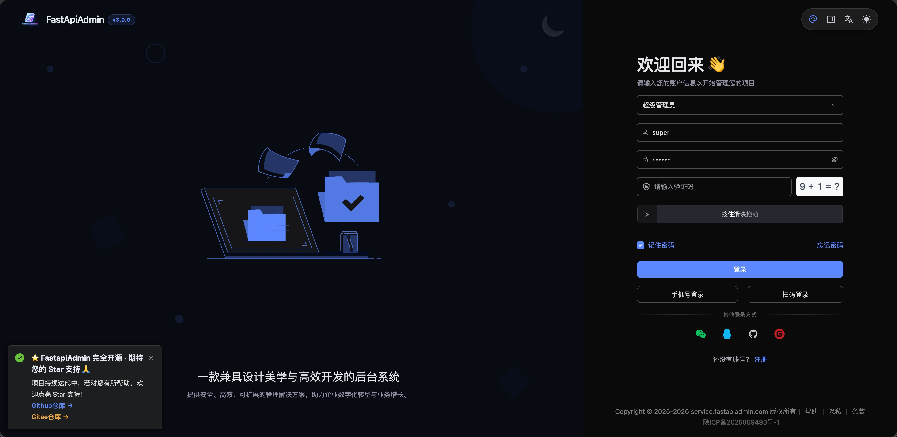
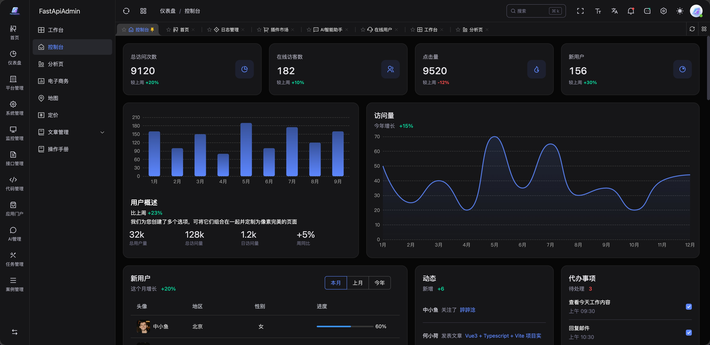
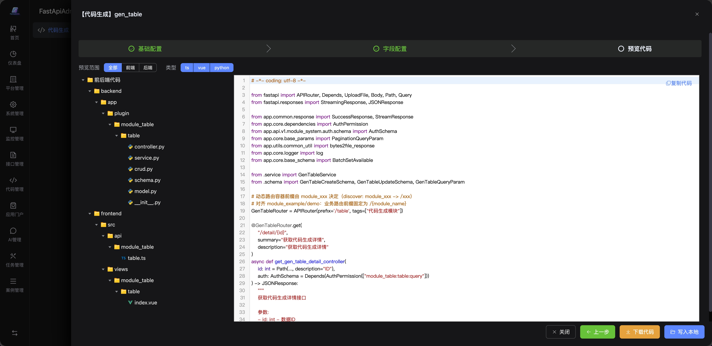

<div align="center">
     <p align="center">
          
     </p>
     <h1>FastApiAdmin <sup style="background-color: #28a745; color: white; padding: 2px 6px; border-radius: 3px; font-size: 0.4em; vertical-align: super; margin-left: 5px;">v3.0.0</sup></h1>
     <h3>Single-organization administration foundation</h3>
     <p>FastAPI + Vue 3 + TypeScript for RBAC, system configuration, audit logs, and an optional AI/RAG plugin.</p>
     <p align="center">
          
          
          
          
          
     </p>

English | [简体中文](./README.md)

</div>

## Quick Start

```bash
# 1. Clone your repository
git clone <repository-url>

# 2. Configure environments
cp backend/env/.env.dev.example backend/env/.env.dev
cp frontend/.env.example frontend/.env

# 3. Start the core backend (auto-creates tables + seed data on first run)
cd backend && uv sync && uv run main.py run --env=dev

# Optional: enable AI knowledge-base and RAG
cd backend && uv sync --extra ai
# Set AI_ENABLE=true in backend/env/.env.dev

# 4. Start frontend
cd ../frontend && pnpm install && pnpm run dev

# ✅ Open http://127.0.0.1:5173, login with admin/123456
```

| Requirements | |
|-------------|------|
| Python ≥ 3.12 | Node.js ≥ 20 + pnpm |
| MySQL 8.0+ / PostgreSQL 14+ | Redis 6.x / 7.x |

## 📦 Structure

```
FastapiAdmin/            # Monorepo full-stack project
├─ backend/              # FastAPI backend (Pydantic 2.0 + SQLAlchemy + Alembic)
├── frontend/             # Vue3 Web (Element Plus + TypeScript)
│   ├── src/
│   ├── public/
│   └── package.json
└─ LICENSE               # MIT
```

## 📌 Built-in Features

| Module | Capabilities |
|--------|-------------|
| 📊 Dashboard | Operational overview and system health |
| ⚙️ System | Users, roles, menus, dictionaries, and parameters |
| 📝 Audit | Login and operation logs |
| 📁 Files | File upload and download |
| 🤖 Optional AI/RAG plugin | Chat, knowledge bases, documents, retrieval, memory, and model configuration |

## 🔧 Screenshots

| Login | Dashboard | Code Generator | AI Assistant |
| ----- | --------- | -------------- | ------------ |
|  |  |  |  |

## 📖 Documentation

- 📁 Sub-project READMEs: [backend](backend/README.md) · [frontend](frontend/README.md) · [Docker](docker/README.md)

## 🙏 Acknowledgments

- Backend: [FastAPI](https://fastapi.tiangolo.com/) · [Pydantic](https://docs.pydantic.dev/) · [SQLAlchemy](https://www.sqlalchemy.org/) · [APScheduler](https://github.com/agronholm/apscheduler)
- Frontend: [Vue3](https://vuejs.org/) · [TypeScript](https://www.typescriptlang.org/) · [Vite](https://vitejs.dev/) · [Element Plus](https://element-plus.org/)
- Mobile: [UniApp](https://uniapp.dcloud.net.cn/) · [Wot Design Uni](https://wot-ui.cn/)
- AI: [Agno](https://github.com/agno-agi/agno)
